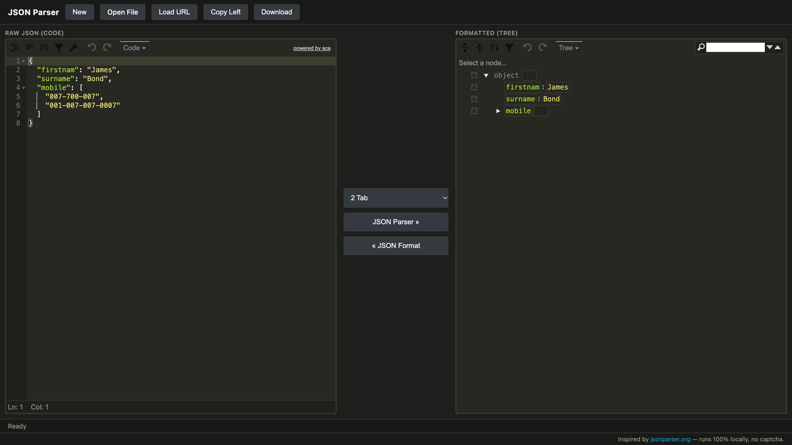
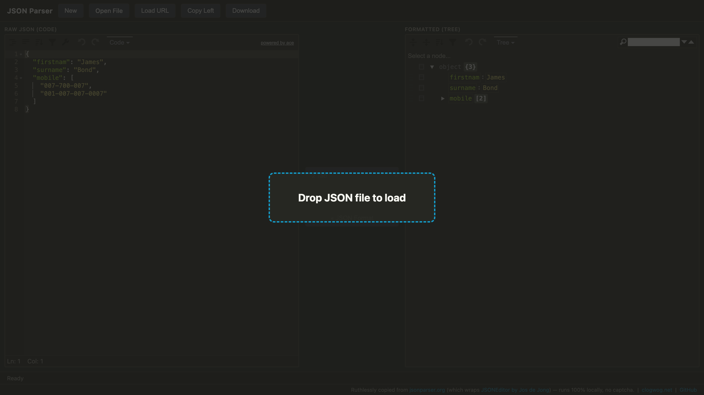

# JSON Parser — Local

Born out of pure frustration with the **captcha on [jsonparser.org](https://jsonparser.org)** —
waiting on a Cloudflare challenge just to paste a bit of JSON is absurd. So here's
the same tool, minus the gatekeeping: it runs entirely on your machine, offline,
with nothing between you and your data.

An offline, no-nonsense JSON formatter, parser, and tree viewer. Paste, open, or
drag-and-drop raw JSON, hit **JSON Parser**, and instantly get a formatted,
collapsible tree on the right. Dark **Monokai** theme by default. No ads, no
accounts, no network calls, no Cloudflare, no captcha — just a local page.

Ships both as a plain web page and as a Chrome / Brave (MV3) extension.



Drag a file anywhere on the page:



## What it does

- **Format / parse** — left pane is a raw JSON code editor; pressing
  **JSON Parser »** validates it and renders a formatted tree on the right.
- **JSON Format** — pushes the tree back to the raw editor (`« JSON Format`).
- **Indentation** — 2 / 3 / 4 space tabs, applied live.
- **Open File** — load a `.json` / `.txt` file from disk.
- **Drag & drop** — drop a JSON file anywhere on the page (or the dropped
  text) to load it into both panes.
- **Load URL** — fetch JSON from a public URL (subject to CORS).
- **Copy Left** / **Download** — copy raw text or save it as `data.json`.
- **Tree tools** — search, sort, expand/collapse, edit values in place, plus
  per-node context menus (all built into the underlying editor).

## Where it came from

This is a cleaned-up local reproduction of [jsonparser.org](https://jsonparser.org).
That site is a thin wrapper around the open-source
[JSONEditor](https://github.com/josdejong/jsoneditor) library by Jos de Jong.

The original page pulls in Cloudflare's "Rocket Loader", Google Analytics,
AdSense, and server-side PHP endpoints (`save.php`, `exp.php`, etc.). This copy
strips all of that out, vendors the editor assets locally, and adds a dark theme
and page-wide drag-and-drop.

Bundled third-party code (in `vendor/`):

- **jsoneditor 9.10.5** — MIT, © Jos de Jong. Includes its bundled Ace editor.

## How it works

Plain HTML/CSS/JS. No build step, no dependencies to install.

```
jsonparser/
├── manifest.json          # Chrome/Brave MV3 manifest
├── background.js          # opens the tool in a tab on toolbar click
├── index.html             # the whole UI + Monokai theme overrides
├── app.js                 # editor wiring: parse, format, tabs, file/drag/URL
├── icons/                 # toolbar icons (generated PNGs)
├── screenshots/
└── vendor/jsoneditor/     # jsoneditor.min.js/.css + icon sprite (offline)
```

- `index.html` builds two `JSONEditor` instances — left in `code` mode (Ace),
  right in `tree` mode.
- `app.js` reads the left editor's text, runs `JSON.parse`, pretty-prints with
  the selected indentation, and pushes the object into the right editor.
- The dark theme is pure CSS in `index.html`, overriding the bundled light
  theme's hardcoded colors (Ace tokens via `.ace-jsoneditor .ace_*`, tree values
  via `.jsoneditor-value.*`, plus the frame, status bar, and menus).
- Ace's syntax worker is disabled (`session.setUseWorker(false)`) because the
  MV3 extension CSP blocks blob workers.
- `background.js` uses `chrome.action.onClicked` (no popup) to open
  `index.html` in a full tab — better than a cramped popup for JSON work.

## Use it as a web page

Clone the repo:

```bash
git clone git@github.com:clogwog/local.jsonparser.org.git
cd local.jsonparser.org
```

Then either open `index.html` directly by double-clicking it (`file://`).
Everything works except **Load URL** and sometimes clipboard access.

Or serve it:

```bash
python3 -m http.server 8000
```

Then open http://localhost:8000.

## Install as a Chrome / Brave extension

Clone the repo first:

```bash
git clone git@github.com:clogwog/local.jsonparser.org.git
```

1. Go to `chrome://extensions` (or `brave://extensions`).
2. Enable **Developer mode**.
3. Click **Load unpacked** and select the cloned `local.jsonparser.org/` folder.
4. Click the toolbar icon — the tool opens in a new tab.

No special permissions are requested.

## Notes / limitations

- **Load URL** depends on the target server sending CORS headers; the original
  site's server-side proxy is intentionally gone.
- There is no "save online" — that feature required a backend. Use **Download**
  instead.

## License

Application code here is free to use. Bundled [jsoneditor](https://github.com/josdejong/jsoneditor)
is MIT licensed; retain its license/attribution if you redistribute it.

## A note to Jos de Jong

Hey Jos, als je het erg vindt haal ik zo weer weg. laat het weten en hij is 'gone'

